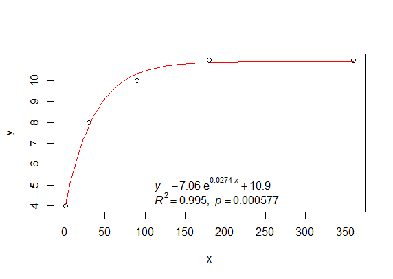

# basicTrendline: an R package for adding trendline of basic regression models to plot

 

 

## Authors

Weiping MEI https://PhDMeiwp.github.io

Graduate School of Fisheries and Environmental Sciences, Nagasaki University

## Installation

Get the released version from CRAN:

	install.packages("basicTrendline")

Or the development version from github:
	
	install.packages("devtools")
	devtools::install_github("PhDMeiwp/basicTrendline@master", force = TRUE)

## Changes in version 1.2.0 on Github

- change the expression for `model` of `exp3P` using a supscript
- add `trendline_summary()` function
- add `SSexp2P()` function
- add `SSpower2P` function
- add `Pvalue.corrected` argument in `trendline()` and `trendline_summary()` , for P-vlaue calculation for non-linear regression.
- add `Details` in `trendline()` and `trendline_summary()` 
- add `...` argument in `trendline()` as same as those in `plot()`

## Description

Plot and show both regression line and equation as simple as possible, by using different models built in the 'trendline()' function. The function includes the following models in the latest version: 

"line2P" (formula as: y=a\*x+b), "line3P" (y=a\*x2+b\*x+c), "log2P" (y=a\*ln(x)+b), "exp2P" (y=a\*eb\*x), "exp3P" (y=a\*eb\*x+c), "power2P" (y=a\*xb), and "power3P" (y=a\*xb+c). 

Besides, the summarized results of each fitted model are also output by default.

## Usage

	trendline(x, y, model = "line2P", Pvalue.corrected = TRUE, linecolor = "red", lty = 1, lwd = 1,
  				summary = TRUE, ePos = "topleft", eDigit = 5, eSize = 1,
  				plot = TRUE, ...)

## Arguments

 **x, y** 	
the x and y arguments provide the x and y coordinates for the plot. Any reasonable way of defining the coordinates is acceptable.

 **model** 	
select which model to fit. Default is "line2P". The "model" should be one of c("line2P", "line3P", "log2P", "exp3P", "power3P"), their formulas are as follows:
 "line2P": y=a\*x+b 
 "line3P": y=a\*x2+b\*x+c 
 "log2P": y=a\*ln(x)+b 
 "exp2P": y=a\*eb\*x
 "exp3P": y=a\*eb\*x+c 
 "power2P": y=a\*xb
 "power3P": y=a\*xb+c

 **Pvalue.corrected** 	
if P-value corrected or not, the vlaue is one of c("TRUE", "FALSE").

 **linecolor** 	
color of regression line.

 **lty** 
line type. lty can be specified using either text c("blank","solid","dashed","dotted","dotdash","longdash","twodash") or number c(0, 1, 2, 3, 4, 5, 6). Note that lty = "solid" is identical to lty=1.

 **lwd**	 
line width. Default is 1.

 **summary**	 
summarizing the model fits. Default is TRUE.

 **ePos** 	
equation position, such as one of c("none","bottomright","bottom","bottomleft","left","topleft","top","topright","right","center").

 **eDigit**	 
the numbers of digits for equation parameters. Default is 5.

 **eSize**	 
font size in percentage of equation. Default is 1.

 **plot** 	
draw a scatter plot automatically, the vlaue is one of c("TRUE", "FALSE").

**...** 
additional parameters to plot,such as type, main, sub, xlab, ylab, col.

## Details

The linear models (line2P, line3P, log2P) in this package are estimated by **lm** function, while the **nonlinear models (exp2P, exp3P, power2P, power3P)** are estimated by **nls** function (i.e., **least-squares method**).
 The argument 'Pvalue.corrected' is workful for non-linear regression only.
 If "Pvalue.corrected = TRUE", the P-vlaue is calculated by using "Residual Sum of Squares" and "Corrected Total Sum of Squares (i.e. sum((y-mean(y))^2))".
 If "Pvalue.corrected = TRUE", the P-vlaue is calculated by using "Residual Sum of Squares" and "Uncorrected Total Sum of Squares (i.e. sum(y^2))".

## Value

R2, indicates the R-Squared value of each regression model.

p, indicates the p-value of each regression model.

AIC or BIC, indicate the Akaike's Information Criterion or Bayesian Information Criterion for fitted model. Click AIC for details. The smaller the AIC or BIC, the better the model.

# Examples
	
Then upload your dataset including x and y data, for example

    x<-c(1,30,90,180,360)
    y<-c(4,8,10,11,11)

 **[case 1] plot and add trendline as default:** 

	library(basicTrendline)

	trendline(x,y,model="exp3P", summary=TRUE, eDigit=3, ePos="bottom",linecolor="red")  

 

**[case 2] plot and add trendline separately:** 

	plot(x,y,yaxt="n",xlab = "your own xaxis name (mg)", ylab = "ylab (‰)")
	axis(2,las=2)  # Change the y-axis text direction

	library(basicTrendline)
	#set plot=FALSE in the following codes
	trendline(x,y, plot=FALSE, model="power3P", summary=TRUE, eDigit=3, ePos="bottom",linecolor="black") 

	
**[case 3] chanage other models, using the same function "trendline()"** 

	library(basicTrendline)

	# change model to "log2P"
	trendline(x,y, model="log2P", summary=TRUE, eDigit=3, ePos="bottom",linecolor="black") 

“model” can be one of c('lin2P','line3P','log2P','exp3P','power3P')
	
- "line2P"    # y=a\*x+b

- "line3P"    # y=a\*x^2+b\*x+c

- "log2P"     # y=a\*ln(x)+b

- "exp3P"     # y=a\*exp(b\*x)+c

- "power3P"   # y=a*x^b+c)

**[case 4] draw different regression lines for the same dataset:**

	x1<-1:5
	y1<-c(2,14,18,19,20)

	plot(x1,y1,main="Different regression lines in one plot")
	
	library(basicTrendline)

	trendline(x1,y1,model="line2P",plot=FALSE,ePos="none",linecolor="red")
	trendline(x1,y1,model="log2P",plot=FALSE,ePos="none",linecolor="blue",lty=2)
	trendline(x1,y1,model="exp3P",plot=FALSE,ePos="none",linecolor="black",lty=3)

	legend("bottomright",c("line2P","log2P","exp3P"), lty=c(1,2,3),col=c("red","blue","black"))

**[case 5] draw trendlines by the same model (e.g. "exp3P") with different datasets:**

import some datasets:

	x1<- c(1,30,90,180,360)
	x2<- c(1,45,90,180,360)
	x3<- c(1,30,60,120,240)

	y1<-c(10,14,18,19,20)    
	y2<- c(8,11,13,15,17) 
	y3<-c(9,13,16,16,16)   

Plot (or points) and add trendlines:

	plot(x1,y1,,pch=1,col="red",xlim = c(0,400),ylim = c(6,22),main="Same regression lines with different datasets",xlab = "Time (days)", ylab = "your ylab (‰)")

	points(x2,y2,pch=2,col="blue")  # pch values refer to different type for points
	points(x3,y3,pch=3,col="green")

	library(basicTrendline)

	# different linecolor and lty (lineType) for each trendline
	trendline(x1,y1,model="exp3P",linecolor="red",lty=1,plot=FALSE,ePos="none",summary = TRUE)->output1
	trendline(x2,y2,model="exp3P",linecolor="blue",lty = 2,plot=FALSE,ePos="none",summary = TRUE)->output2
	trendline(x3,y3,model="exp3P",linecolor="green",lty = 3,plot=FALSE,ePos="none",summary = TRUE)->output3
	
	# add legend
	legend("bottomright",c("x1y1","x2y2","x3y3"),pch=c(1,2,3), lty=c(1,2,3),col=c("red","blue","green"))

	## return the results of each trendline as follow:
	output1
	output2
	output3

---

To see examples on how to use "basicTrendline" in R software, you can run the following R code if you have the "basicTrendline" package installed:

    library(basicTrendline)
    ?trendline()

## Contributions

R codes contributed by

- adding-regression-line-equation-and-r2-on-graph-1: http://blog.sciencenet.cn/blog-267448-1021594.html
- adding-regression-line-equation-and-r2-on-graph-2: https://stackoverflow.com/questions/7549694/adding-regression-line-equation-and-r2-on-graph
- What is non-linear regression?: https://datascienceplus.com/first-steps-with-non-linear-regression-in-r/
- adding regression line for nonlinear regression: http://blog.sciencenet.cn/blog-651374-1014133.html
- R codes for 'print.summary.nls of exp3P and power3P' cite from https://github.com/SurajGupta/r-source/blob/master/src/library/stats/R/nls.R
- and so on...

## Contact

- If you have any question or comment to this package, tell me at [here](http://meiweiping.cn/en/basicTrendline-an-R-package-for-adding-trendline-of-basic-regression-models-to-plot/).

- Bugs and feature requests can be filed to https://github.com/PhDMeiwp/basicTrendline/issues. BTW, [Pull requests](https://github.com/PhDMeiwp/basicTrendline/pulls) are also welcome.

## Appendix

The **PDF file** of this R package is available at https://cran.r-project.org/web/packages/basicTrendline/index.html 

>> 点击进入 [basicTrendline函数包中文介绍入口](http://meiweiping.cn/%E7%94%A8%E4%BA%8E%E5%B8%B8%E8%A7%84%E7%BA%BF%E6%80%A7%E9%9D%9E%E7%BA%BF%E6%80%A7%E6%8B%9F%E5%90%88%E7%9A%84R%E5%87%BD%E6%95%B0%E5%8C%85%EF%BC%88basicTrendline%EF%BC%89%E4%BB%8B%E7%BB%8D/)