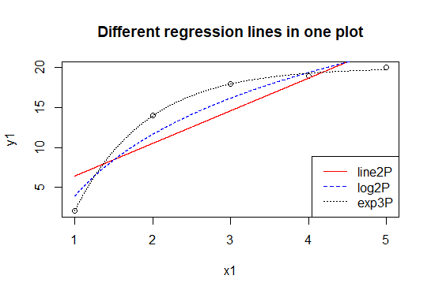
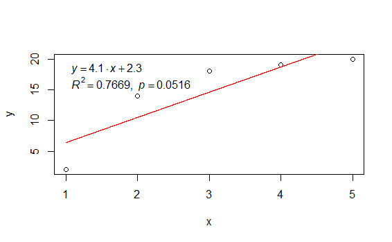
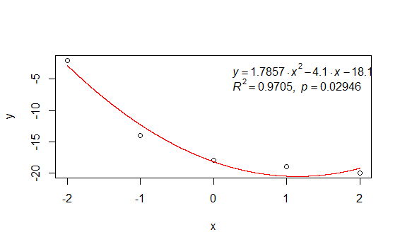
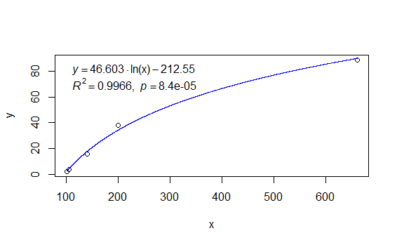
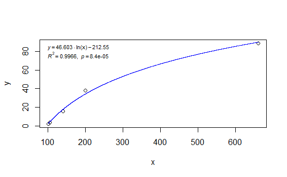
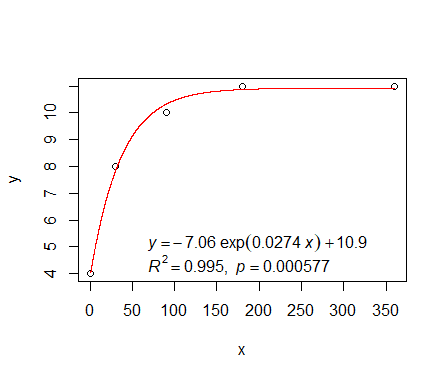
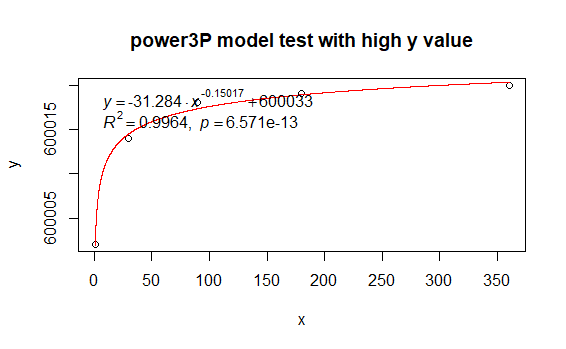

# basicTrendline: an R package for adding trendline of basic regression models to plot

 

## Installing "basicTrendline" package in R

1\. from R (Open R software and run:)

	install.packages("basicTrendline")
	library(basicTrendline)

2\. from Github 

You can install directly **from GitHub** if you have the devtools package installed:

    install.packages("devtools")
	library(devtools)   
	install_github("PhDMeiwp/basicTrendline@master", force = TRUE)
	library(basicTrendline)

## Using "basicTrendline" package
	
Then upload your dataset including x and y data, for example

    x<-c(1,30,90,180,360)
    y<-c(4,8,10,11,11)

and run 

	library(basicTrendline)

	trendline(x,y,model="exp3P", summary=TRUE, eDigit=10, ePos="topleft",linecolor="red")  
	
You can chanage other models, using the same function "trendline()"

“model” is one of c('lin2P','line3P','log2P','exp3P','power3P')
	
- "line2P"    # y=a\*x+b

- "line3P"    # y=a\*x^2+b\*x+c

- "log2P"     # y=a\*ln(x)+b

- "exp3P"     # y=a\*exp(b\*x)+c

- "power3P"   # y=a*x^b+c)

**Moreover**, we can draw **different regression lines in one plot!!!**

	plot(x1,y1,main="Different regression lines in one plot")
	
	library(basicTrendline)
	trendline(x1,y1,model="line2P",plot=FALSE,ePos="none",linecolor="red")
	trendline(x1,y1,model="log2P",plot=FALSE,ePos="none",linecolor="blue",lty=2)
	trendline(x1,y1,model="exp3P",plot=FALSE,ePos="none",linecolor="black",lty=3)
	legend("bottomright",c("line2P","log2P","exp3P"), lty=c(1,2,3),col=c("red","blue","black"))

## Highlights

The "basicTrendline" package in R software could output **a better regression result (higher R2 and lower p-value)** for 'power3P' model（y = ax^b +c） **than those in OriginPro** software. Please see the example below:

>formula as y=a*x^b +c

x<- c(1,30,60,90,180,360)

y<- c(2,14,16,18,19,20)  # increase convex-function

>in OriginPro software:

c=-7344.578

a=7347.183

b=43224.4

**adjR2= 0.97129       # lower adjR2 value**

p-value of model=2.24891e-4

>in the 'basicTrendline' R package:

c=34.671

a=-32.703

b=-0.13999

**adjR2= 0.99346 >  0.97129   # higher (or better ) adjR2 value**

p-value of model= 2.44924-5 < 2.24891e-4

## Graphics

To see examples on how to use "basicTrendline" in R software, you can run the following R code if you have the "basicTrendline" package installed:

    library(basicTrendline)
    ?trendline()

## Contributions

R codes contributed by

- adding-regression-line-equation-and-r2-on-graph-1: http://blog.sciencenet.cn/blog-267448-1021594.html
- adding-regression-line-equation-and-r2-on-graph-2: https://stackoverflow.com/questions/7549694/adding-regression-line-equation-and-r2-on-graph
- What is non-linear regression?: https://datascienceplus.com/first-steps-with-non-linear-regression-in-r/
- adding regression line for nonlinear regression: http://blog.sciencenet.cn/blog-651374-1014133.html
- R codes for 'print.summary.nls of exp3P and power3P' cite from https://github.com/SurajGupta/r-source/blob/master/src/library/stats/R/nls.R
- and so on...

## Contact

- If you have any question or comment to this package, tell me at [here](http://meiweiping.cn/en/basicTrendline-an-R-package-for-adding-trendline-of-basic-regression-models-to-plot/).

- Bugs and feature requests can be filed to https://github.com/PhDMeiwp/basicTrendline/issues. BTW, [Pull requests](https://github.com/PhDMeiwp/basicTrendline/pulls) are also welcome.

## Appendix

The **PDF file** of this R package is available at https://cran.r-project.org/web/packages/basicTrendline/index.html 

>> 点击进入 [basicTrendline函数包中文介绍入口](http://meiweiping.cn/%E7%94%A8%E4%BA%8E%E5%B8%B8%E8%A7%84%E7%BA%BF%E6%80%A7%E9%9D%9E%E7%BA%BF%E6%80%A7%E6%8B%9F%E5%90%88%E7%9A%84R%E5%87%BD%E6%95%B0%E5%8C%85%EF%BC%88basicTrendline%EF%BC%89%E4%BB%8B%E7%BB%8D/)