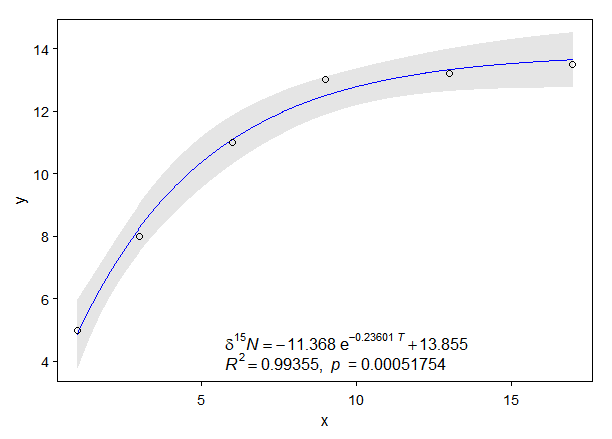

# basicTrendline: an R package for adding trendline of basic regression models to plot

 

 

## Authors

Weiping MEI https://PhDMeiwp.github.io

Graduate School of Fisheries and Environmental Sciences, Nagasaki University

## Installation

Get the released version from CRAN:

	install.packages("basicTrendline")

Or the development version from github:
	
	install.packages("devtools")
	devtools::install_github("PhDMeiwp/basicTrendline@master", force = TRUE)

## Changes in version 2.0.1	

- add several arguments to `trendline()` function
- enable to draw confidence interval for regression models
- enable to choose which parameter (equation, R-square and p-value) to show

## Changes in version 1.2.0

- change the expression for `model` of `exp3P` using a supscript
- add `trendline_summary()` function
- add `SSexp2P()` function
- add `SSpower2P` function
- add `Pvalue.corrected` argument in `trendline()` and `trendline_summary()` , for P-vlaue calculation for non-linear regression.
- add `Details` in `trendline()` and `trendline_summary()` 
- add `...` argument in `trendline()` as same as those in `plot()`

## Description

Plot, draw regression line and confidence interval, and show regression equation, R-square and P-value, as simple as possible, 

by using different models built in the 'trendline()' function. The function includes the following models in the latest version: 

"line2P" (formula as: y=a\*x+b), 

"line3P" (y=a\*x2+b\*x+c), 

"log2P" (y=a\*ln(x)+b), 

"exp2P" (y=a\*eb\*x), 

"exp3P" (y=a\*eb\*x+c), 

"power2P" (y=a\*xb), 

"power3P" (y=a\*xb+c). 

Besides, the summarized results of each fitted model are also output by default.

## Usage

     trendline(x, y, model = "line2P", Pvalue.corrected = TRUE,
			linecolor = "blue", lty = 1, lwd = 1, 
			show.equation = TRUE, show.Rpvalue = TRUE, 
			summary = TRUE, 
			ePos = "topleft", eDigit = 5, eSize = 1, 
			CI.fill = TRUE, CI.level = 0.95, CI.color = "grey",	CI.alpha = 1, CI.lty = 1, CI.lwd = 1, 
			las = 1, xlab = NULL, ylab = NULL, ...)

## Arguments

 **x, y** 	
the x and y arguments provide the x and y coordinates for the plot. Any reasonable way of defining the coordinates is acceptable.

 **model** 	
select which model to fit. Default is "line2P". The "model" should be one of c("line2P", "line3P", "log2P", "exp3P", "power3P"), their formulas are as follows:
 "line2P": y=a\*x+b 
 "line3P": y=a\*x2+b\*x+c 
 "log2P": y=a\*ln(x)+b 
 "exp2P": y=a\*eb\*x
 "exp3P": y=a\*eb\*x+c 
 "power2P": y=a\*xb
 "power3P": y=a\*xb+c

 **Pvalue.corrected** 	
if P-value corrected or not, the vlaue is one of c("TRUE", "FALSE").

 **linecolor** 	
color of regression line.

 **lty** 
line type. lty can be specified using either text c("blank","solid","dashed","dotted","dotdash","longdash","twodash") or number c(0, 1, 2, 3, 4, 5, 6). Note that lty = "solid" is identical to lty=1.

 **lwd**	 
line width. Default is 1.

 **show.equation**	 
whether to show the regression equation, the value is one of c("TRUE", "FALSE").

 **show.Rpvalue**	 
whether to show the R-square and P-value, the value is one of c("TRUE", "FALSE").

 **summary**	 
summarizing the model fits. Default is TRUE.

 **ePos** 	
equation position, such as one of c("none","bottomright","bottom","bottomleft","left","topleft","top","topright","right","center").

 **eDigit**	 
the numbers of digits for equation parameters. Default is 5.

 **eSize**	 
font size in percentage of equation. Default is 1.

 **CI.fill** 	
fill the confidance interval? (TRUE by default, see 'CI.level' to control)

 **CI.level** 		
level of confidence interval to use (0.95 by default)

 **CI.color** 		
line or fill color of confidence interval.

 **CI.alpha** 		
alpha value of fill color of confidence interval.

 **CI.lty** 		
line type of confidence interval.

 **CI.lwd** 		
line width of confidence interval.

 **las** 		
style of axis labels. (0=parallel, 1=all horizontal, 2=all perpendicular to axis, 3=all vertical)

 **xlab, ylab** 		
labels of x- and y-axis.

**...** 
additional parameters to plot,such as type, main, sub, xlab, ylab, col.

## Details

The linear models (line2P, line3P, log2P) in this package are estimated by **lm** function, while the **nonlinear models (exp2P, exp3P, power2P, power3P)** are estimated by **nls** function (i.e., **least-squares method**).
 The argument 'Pvalue.corrected' is workful for non-linear regression only.
 If "Pvalue.corrected = TRUE", the P-vlaue is calculated by using "Residual Sum of Squares" and "Corrected Total Sum of Squares (i.e. sum((y-mean(y))^2))".
 If "Pvalue.corrected = TRUE", the P-vlaue is calculated by using "Residual Sum of Squares" and "Uncorrected Total Sum of Squares (i.e. sum(y^2))".

## Note

Confidence intervals for nonlinear regression (i.e., objects of class nls) are based on the linear approximation described in Bates & Watts (2007).

## References

Bates, D. M., and Watts, D. G. (2007) *Nonlinear Regression Analysis and its Applications*. Wiley.

## Value

R2, indicates the R-Squared value of each regression model.

p, indicates the p-value of each regression model.

AIC or BIC, indicate the Akaike's Information Criterion or Bayesian Information Criterion for fitted model. Click AIC for details. The smaller the AIC or BIC, the better the model.

# Examples
	
		library(basicTrendline)
		x1 <- 1:5
		x2 <- -2:2
		x3 <- c(101,105,140,200,660)
		x4 <- -5:-1

		y1 <- c(2,14,18,19,20)       # increasing convex  trend
		y2 <- c(-2,-14,-18,-19,-20)  # decreasing concave trend
		y3 <- c(2,4,16,38,89)        # increasing concave trend
		y4 <- c(-2,-4,-16,-38,-89)   # decreasing convex  trend

 **[case 1] default (plot, regression line, confidence interval)** 

		library(basicTrendline)
		trendline(x1, y1, model="line2P", summary=TRUE, eDigit=10)

 

**[case 2] show equation only** 

		trendline(x1, y1, model="line2P", show.equation = TRUE, show.Rpvalue = FALSE)

	
**[case 3]  'eSize' is used to change the font size of equation** 

		trendline(x2, y2, model="line3P", summary=FALSE,ePos="topright", linecolor="red", eSize=0.7)

**[case 4] lines of confidenc interval only (i.e. not fill)**

		trendline(x3, y3, model="log2P", CI.fill = FALSE, CI.color = "black", CI.lty = 2)

**[case 5] trendliine only (i.e. without confidence interval)**

		trendline(x4, y4, model="exp3P", ePos="bottom", CI.color = NA)
	

---

To see examples on how to use "basicTrendline" in R software, you can run the following R code if you have the "basicTrendline" package installed:

    library(basicTrendline)
    ?trendline()

## Contributions

R codes contributed by

- adding conficende interval for both lm and nls objects: https://github.com/bgreenwell/investr
- adding-regression-line-equation-and-r2-on-graph-1: http://blog.sciencenet.cn/blog-267448-1021594.html
- adding-regression-line-equation-and-r2-on-graph-2: https://stackoverflow.com/questions/7549694/adding-regression-line-equation-and-r2-on-graph
- What is non-linear regression?: https://datascienceplus.com/first-steps-with-non-linear-regression-in-r/
- adding regression line for nonlinear regression: http://blog.sciencenet.cn/blog-651374-1014133.html
- R codes for 'print.summary.nls of exp3P and power3P' cite from https://github.com/SurajGupta/r-source/blob/master/src/library/stats/R/nls.R

## Contact

- If you have any question or comment to this package, tell me at [here](http://meiweiping.cn/en/basicTrendline-an-R-package-for-adding-trendline-of-basic-regression-models-to-plot/).

- Bugs and feature requests can be filed to https://github.com/PhDMeiwp/basicTrendline/issues. BTW, [Pull requests](https://github.com/PhDMeiwp/basicTrendline/pulls) are also welcome.

## Appendix

The **PDF file** of this R package is available at https://cran.r-project.org/web/packages/basicTrendline/index.html 

>> 点击进入 [basicTrendline函数包中文介绍入口](http://meiweiping.cn/%E7%94%A8%E4%BA%8E%E5%B8%B8%E8%A7%84%E7%BA%BF%E6%80%A7%E9%9D%9E%E7%BA%BF%E6%80%A7%E6%8B%9F%E5%90%88%E7%9A%84R%E5%87%BD%E6%95%B0%E5%8C%85%EF%BC%88basicTrendline%EF%BC%89%E4%BB%8B%E7%BB%8D/)