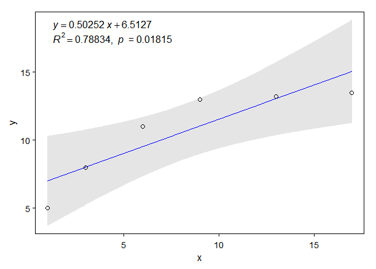
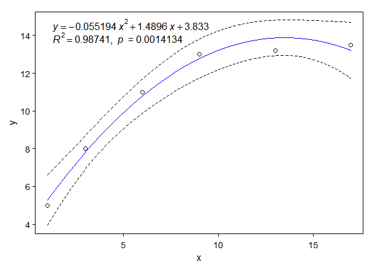
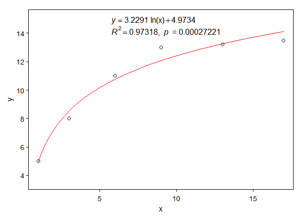

# basicTrendline: an R package for adding trendline of basic regression models to plot

 

## Kindly reminder

\1. Thank you everyone for using 'basicTrendline' package, but it was recently removed from the CRAN repository;
\2. Now, I suggest you to use our new 'ggtrendline' package instead of 'basicTrendline';
\3. Links of 'ggtrendline' package: (1) https://cran.r-project.org/package=ggtrendline and (2) https://github.com/PhDMeiwp/ggtrendline

## Authors

Weiping MEI https://PhDMeiwp.github.io

Graduate School of Fisheries and Environmental Sciences, Nagasaki University

## Citation

Mei W, Yu G, Lai J, Rao Q, Umezawa Y (2018) basicTrendline: Add Trendline and Confidence Interval of Basic Regression Models to Plot. R package version 2.0.3. http://CRAN.R-project.org/package=basicTrendline

## Installation

from github:
	
	install.packages("devtools")
	devtools::install_github("PhDMeiwp/basicTrendline@master", force = TRUE)

## Changes in version 2.0.6 (2022-02-19)

- add 'AICc' to trendline_summary function for small sample size of the data set.

---

# Examples
	
		library(basicTrendline)
		x <- c(1, 3, 6,  9,  13,   17)
		y <- c(5, 8, 11, 13, 13.2, 13.5)

# [case 0]  ggplot2-like trendline by par {graphics}

		par(mgp=c(1.5,0.4,0), mar=c(3,3,1,1), tck=-0.01, cex.axis=0.9)
		trendline(x, y, "exp3P")
		# dev.off()

# [case 1] default
		trendline(x, y, model="line2P", ePos.x = "topleft", summary=TRUE, eDigit=5)

# [case 2]  draw lines of confidenc interval only (set CI.fill = FALSE)
		trendline(x, y, model="line3P", CI.fill = FALSE, CI.color = "black", CI.lty = 2, linecolor = "blue")

# [case 3]  draw trendliine only (set CI.color = NA)
		trendline(x, y, model="log2P", ePos.x= "top", linecolor = "red", CI.color = NA)

# [case 4]  show regression equation only (set show.Rpvalue = FALSE)
		trendline(x, y, model="exp2P", show.equation = TRUE, show.Rsquare = FALSE, show.pvalue = FALSE)

# [case 5]  specify the name of parameters in equation
** see Arguments c('xname', 'yname', 'yhat', 'Rname', 'Pname') **
		trendline(x, y, model="exp3P", xname="T", yname=paste(delta^15,"N"),
				yhat=FALSE, Rname=1, Pname=0, ePos.x = "bottom")

# [case 6]  change the digits, font size, and color of equation.
		trendline(x, y, model="power2P", eDigit = 3, eSize = 1.4, text.col = "blue")

		
# [case 7]  don't show equation (set ePos.x = NA)
		trendline(x, y, model="power3P", ePos.x = NA)

---

## Description

Plot, draw regression line and confidence interval, and show regression equation, R-square and P-value, as simple as possible, 

by using different models built in the 'trendline()' function. The function includes the following models in the latest version: 

"line2P" (formula as: y=a\*x+b), 

"line3P" (y=a\*x2+b\*x+c), 

"log2P" (y=a\*ln(x)+b), 

"exp2P" (y=a\*eb\*x), 

"exp3P" (y=a\*eb\*x+c), 

"power2P" (y=a\*xb), 

"power3P" (y=a\*xb+c). 

Besides, the summarized results of each fitted model are also output by default.

## Usage

     trendline(x, y, model = "line2P", Pvalue.corrected = TRUE,
			linecolor = "blue", lty = 1, lwd = 1, 
			show.equation = TRUE, show.Rsquare = TRUE, show.pvalue = TRUE,
			Rname = 1, Pname = 0, xname = "x", yname = "y",
			yhat = FALSE, 
			summary = TRUE, 
			ePos.x = NULL, ePos.y = NULL, text.col = "black", eDigit = 5, eSize = 1, 
			CI.fill = TRUE, CI.level = 0.95, CI.color = "grey",	CI.alpha = 1, CI.lty = 1, CI.lwd = 1, 
			las = 1, xlab = NULL, ylab = NULL, ...)

## Arguments

 **x, y** 	
the x and y arguments provide the x and y coordinates for the plot. Any reasonable way of defining the coordinates is acceptable.

 **model** 	
select which model to fit. Default is "line2P". The "model" should be one of c("line2P", "line3P", "log2P", "exp3P", "power3P"), their formulas are as follows:
 "line2P": y=a\*x+b 
 "line3P": y=a\*x2+b\*x+c 
 "log2P": y=a\*ln(x)+b 
 "exp2P": y=a\*eb\*x
 "exp3P": y=a\*eb\*x+c 
 "power2P": y=a\*xb
 "power3P": y=a\*xb+c

 **Pvalue.corrected** 	
if P-value corrected or not, the vlaue is one of c("TRUE", "FALSE").

 **linecolor** 	
color of regression line.

 **lty** 
line type. lty can be specified using either text c("blank","solid","dashed","dotted","dotdash","longdash","twodash") or number c(0, 1, 2, 3, 4, 5, 6). Note that lty = "solid" is identical to lty=1.

 **lwd**	 
line width. Default is 1.

 **show.equation**	 
whether to show the regression equation, the value is one of c("TRUE", "FALSE").

 **show.Rsquare**	 
whether to show the R-square, the value is one of c("TRUE", "FALSE").

 **show.pvalue**	 
whether to show the P-value, the value is one of c("TRUE", "FALSE").

 **Rname**	 	
to specify the character of R-square, the value is one of c(0, 1), corresponding to c(r^2, R^2).

 **Pname**	 	
to specify the character of P-value, the value is one of c(0, 1), corresponding to c(p, P).

 **xname**	 	
to specify the character of "x" in equation, see Examples [case 5].

 **yname**	 	
to specify the character of "y" in equation, see Examples [case 5].

 **yhat**	 	
whether to add a hat symbol (^) on the top of "y" in equation. Default is FALSE.

 **summary**	 
summarizing the model fits. Default is TRUE.

 **ePos.x, ePos.y** 	
equation position. Default as ePos.x = "topleft". If no need to show equation, set ePos.x = NA. It's same as those in legend.

 **text.col** 
the color used for the legend text.

 **eDigit**	 
the numbers of digits for equation parameters. Default is 5.

 **eSize**	 
font size in percentage of equation. Default is 1.

 **CI.fill** 	
fill the confidance interval? (TRUE by default, see 'CI.level' to control)

 **CI.level** 		
level of confidence interval to use (0.95 by default)

 **CI.color** 		
line or fill color of confidence interval.

 **CI.alpha** 		
alpha value of fill color of confidence interval.

 **CI.lty** 		
line type of confidence interval.

 **CI.lwd** 		
line width of confidence interval.

 **las** 		
style of axis labels. (0=parallel, 1=all horizontal, 2=all perpendicular to axis, 3=all vertical)

 **xlab, ylab** 		
labels of x- and y-axis.

**...** 
additional parameters to plot,such as type, main, sub, xlab, ylab, col.

## Details

The linear models (line2P, line3P, log2P) in this package are estimated by **lm** function, while the **nonlinear models (exp2P, exp3P, power2P, power3P)** are estimated by **nls** function (i.e., **least-squares method**).
 The argument 'Pvalue.corrected' is only valid for non-linear regression.
 If "Pvalue.corrected = TRUE", the P-vlaue is calculated by using "Residual Sum of Squares" and "Corrected Total Sum of Squares (i.e. sum((y-mean(y))^2))".
 If "Pvalue.corrected = FALSE", the P-vlaue is calculated by using "Residual Sum of Squares" and "Uncorrected Total Sum of Squares (i.e. sum(y^2))".

## Note

Confidence intervals for nonlinear regression (i.e., objects of class nls) are based on the linear approximation described in Bates & Watts (2007).

## References

Bates, D. M., and Watts, D. G. (2007) *Nonlinear Regression Analysis and its Applications*. Wiley.

Greenwell B. M., and Schubert-Kabban, C. M. (2014) *investr: An R Package for Inverse Estimation*. The R Journal, 6(1), 90-100.

## Value

R2, indicates the R-Squared value of each regression model.

p, indicates the p-value of each regression model.

AIC or BIC, indicate the Akaike's Information Criterion or Bayesian Information Criterion for fitted model. Click AIC for details. The smaller the AIC or BIC, the better the model.

RSS, indicates the "Residual Sum of Squares” of regression model.

---

To see examples on how to use "basicTrendline" in R software, you can run the following R code if you have the "basicTrendline" package installed:

    library(basicTrendline)
    ?trendline()

## Acknowledgements

We would like to express my special thanks to **Uwe Ligges, Swetlana Herbrandt, and CRAN team** for their very valuable comments to the 'basicTrendline' package.
Our thanks also go to those who contributed R codes by:

- adding conficende interval for both lm and nls objects: https://github.com/bgreenwell/investr
- adding-regression-line-equation-and-r2-on-graph-1: http://blog.sciencenet.cn/blog-267448-1021594.html
- adding-regression-line-equation-and-r2-on-graph-2: https://stackoverflow.com/questions/7549694/adding-regression-line-equation-and-r2-on-graph
- What is non-linear regression?: https://datascienceplus.com/first-steps-with-non-linear-regression-in-r/
- adding regression line for nonlinear regression: http://blog.sciencenet.cn/blog-651374-1014133.html
- R codes for 'print.summary.nls of exp3P and power3P' cite from https://github.com/SurajGupta/r-source/blob/master/src/library/stats/R/nls.R

## Contact

- If you have any question or comment to this package, tell me at [here](http://meiweiping.cn/en/basicTrendline-an-R-package-for-adding-trendline-of-basic-regression-models-to-plot/).

- Bugs and feature requests can be filed to https://github.com/PhDMeiwp/basicTrendline/issues. BTW, [Pull requests](https://github.com/PhDMeiwp/basicTrendline/pulls) are also welcome.

## Appendix

The **PDF file** of this R package is available at https://cran.r-project.org/web/packages/basicTrendline/index.html 

> 点击进入 [basicTrendline函数包中文介绍入口](http://meiweiping.cn/%E7%94%A8%E4%BA%8E%E5%B8%B8%E8%A7%84%E7%BA%BF%E6%80%A7%E9%9D%9E%E7%BA%BF%E6%80%A7%E6%8B%9F%E5%90%88%E7%9A%84R%E5%87%BD%E6%95%B0%E5%8C%85%EF%BC%88basicTrendline%EF%BC%89%E4%BB%8B%E7%BB%8D/)